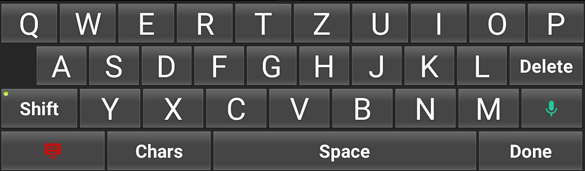

# Super Simple Keyboard
Custom keyboard for Android designed with the focus on elderly and people who have disabilities. Supports layout switching, _Google voice input_.
This is still WIP in very early state. Works best on tablets in landscape-mode.

This project is heavily based on previous work of __Andreas Madner__ and his project [__SMSsenior_Keyboard__][1]
## Implemented
+ Two basic layouts:
  + Alphabetic layout _abcde..._ - the original layout designed by Andreas Madner
  + Typewriter layout _qwertz..._ - new typewriter-like (qwertz) layout
+ Input method settings with layout selection. Can be invoked by tapping on the _SuperSimpleKeyboard_ icon in the app overview or by tapping on the _SuperSimpleKeyboard_ entry in _Settings -> Input methods_.
+ Localization in _German_ and _Czech_
+ Dedicated key for dismissing the keyboard (typewriter layout only atm.)
+ Dedicated key launchoig the _Google voice input_ IMe (if present)

## ToDO
+ Rework of all supported laoyuts
+ Fixing key-labels sometimes sticking out of the keys
+ Code-cleanup

[1]: https://github.com/AndreasMadner/SMSsenior_Keyboard
